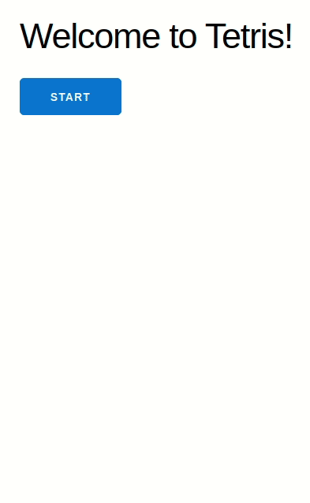

# Tetris

Tetris game made using Elixir's [Phoenix Live View](https://github.com/phoenixframework/phoenix_live_view), following this [YouTube series](https://www.youtube.com/playlist?list=PLKBMoE8mCkXj9KTMNWYgvTFRyahT6PF2q).

## Structure

The game is divided into two projects:

- `core/`: Game logic
- `tetris_ui/`: Phoenix project containing the "presentational" and LiveView logic

## To run

Make sure you have Phoenix installed and:

- Go to the `tetris_ui` folder with `cd tetris_ui/`
- Install dependencies with `mix deps.get`
- Install Node.js dependencies with `npm install` inside the `assets` directory
- Start Phoenix server with `mix phx.server`

Now access [`localhost:4000`](http://localhost:4000) from your browser.

#### Elixir Version and Phoenix Version
Made using Elixir 1.11.2 (compiled with Erlang/OTP 23) and Phoenix v1.5.7